# Equipment List

Here's a list of test equipment that I've used and can personally recommend!

# Soldering

## Soldering Equipment

| Item |Image|Unit Cost|Link|Note|
|------|-----|---------|----|----|
| JBC CD-1BQF Soldering Station    |  | $620.00 | [Tequipment.net](https://www.tequipment.net/JBC/CD-1BQF/Soldering-Stations/?v=0) | IMO: Much nicer UI than Hakko stations, more temperature flexibility than Metcal stations. One-handed tip changing is super convenient. |
| JBC C245768 General Purpose Chisel Tip |  | $37.00 | [Tequipment.net](https://www.tequipment.net/JBC/C245768/Tips/) | Good for most solder joints and SMD / THT work. |
| JBC C245741 Large Chisel Tip |  | $37.00 | [Tequipment.net](https://www.tequipment.net/JBC/C245741/Tips/) | Good for large gauge wires, big copper planes. |
| JBC C245126 Fine Bent Tip |  | $37.00 | [Tequipment.net](https://www.tequipment.net/JBC/C245126/Tips/) | Good for fine pitch rework. |
| Hakko 611-2 Dual Solder Reel Stand |  | $19 | [Amazon](https://amzn.to/4aPKSgm) | I use one reel for water wash solder, one reel for no clean solder (make sure to label which is which!). Can be grounded to your workbench's grounding system with the screw in the back. Little solder wire holders ensure that the solder itself stays in a convenient position and is also grounded (not really necessary but what the heck, we're allowed to have nice things). |
| Quick 861DW Hot Air Station | 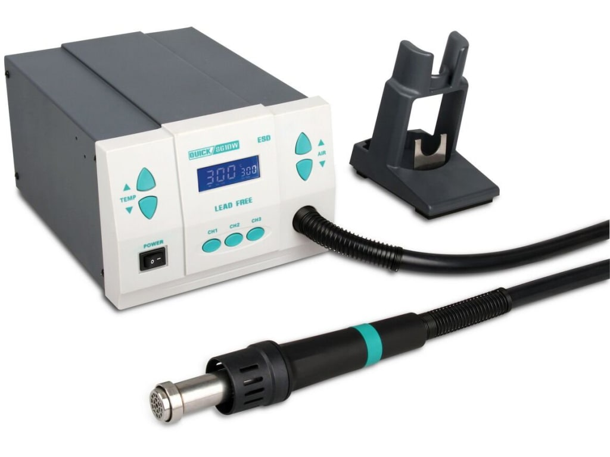 | $270 | [Tequipment.net](https://www.tequipment.net/Quick/861DW/Desoldering-Equipment/Rework-Stations/) |
| Hakko FA-400-04 Benchtop Smoke Absorber |  | $82 | [Amazon](https://amzn.to/3JaUsyT) | Can be laid on the bench face-down for higher velocity airflow close to the bench.    [Replacement Filters](https://amzn.to/4aQOv5Z) |

## Soldering Consumables

I generally like working with leaded solder, since it has a lower melting temperature and is often better behaved. Just don't eat it! If you're working on consumer products or other items that must comply with RoHS you will probably need to get unleaded solder instead.

In general, I've found that 24AWG (0.020" / 0.51mm) solder is a nice size to work with that is suitable for both small SMD and wire harness work, and that Sn63Pb37 is a more forgiving alloy than some of the older Sn60Pb40 blends.

| Item |Image|Unit Cost|Link|Note|
|------|-----|---------|----|----|
| kester 24-6337-9702 Rosin Mildly Activated Sn63Pb37 20AWG Solder (No Clean) | 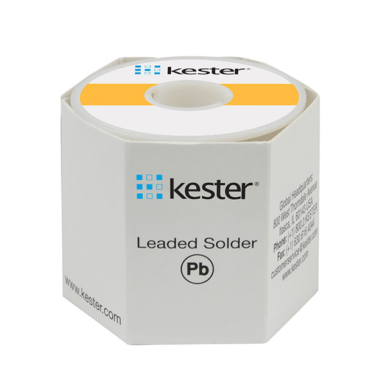 | $60 | [Digikey](https://www.digikey.com/en/products/detail/kester-solder/24-6337-9702/3660026) | Good general purpose solder. Cleaning not required, as the flux hardens into a crusty amber-like layer that isn't sticky or corrosive. If you do decide to clean this flux, be sure to use 90% Isopropyl or flux remover, as a regular water wash will leave white residue all over your board. |
| Kester 24-6337-6403 Water Soluble Sn63Pb37 20AWG Solder | 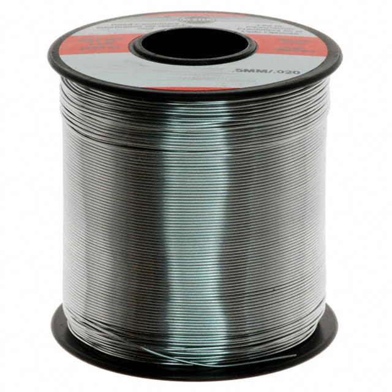 | $75 | [Digikey](https://www.digikey.com/en/products/detail/kester-solder/24-6337-6401/6032) | Joints must be water washed after soldering, as this flux will remain conductive and cause corrosion if it's left on the board! Use this when you need your board to be really clean after soldering, and you know for sure that you're going to do a water wash (e.g. you're planning to do a conformal coat or something). Water wash should be done with deionized water to avoid mineral contamination. Hot water is most effective.   I use this solder if I'm attaching some parts to a board just before it's getting tossed into my ultrasonic cleaner, which is filled with hot deionized water and cleans this up a treat. |
| Chip Quik SMD291AX Sn63Pb37 No-Clean T3 Solder Paste | 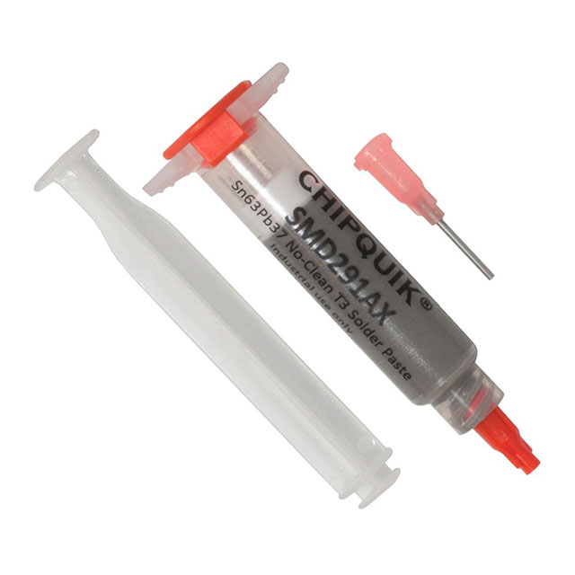 | $15 | [Digikey](https://www.digikey.com/en/products/detail/chip-quik-inc/SMD291AX/1160002) | T3 mesh is good enough for most of what I do. This solder paste needs to be refrigerated! I recommend using a small cosmetics fridge like [this one](https://amzn.to/3VM2cie) (for the love of god don't put it in a refrigerator that also contains food). If it dries out after being in the syringe for a few months, you can rehydrate it by mixing it with a little bit of liquid flux (don't use tack flux, as it will leave goopy lumps). |
| Chip Quik SMD4300AX Water Soluble No-Clean T4 Solder Paste | 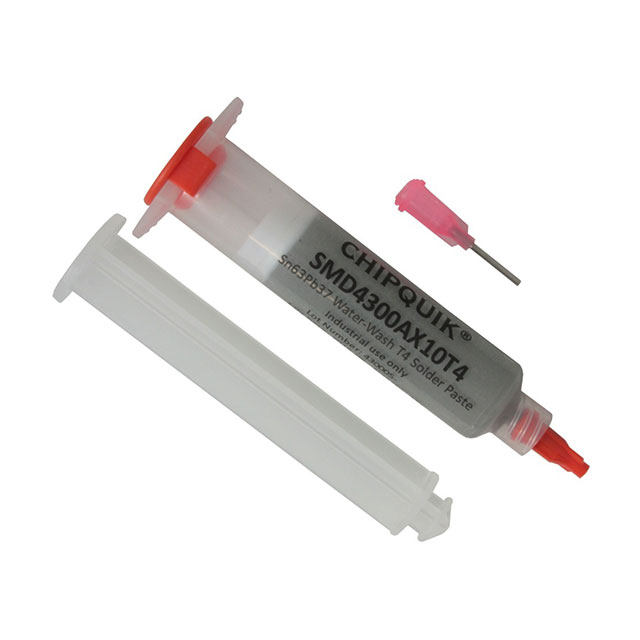 | $28 | [Digikey](https://www.digikey.com/en/products/detail/chip-quik-inc/SMD4300AX10T4/5287432) | Use this solder paste if you are planning to use a water wash process! Comes in T3, T4, T5, but I think T3 is only available in jar form. Must be refrigerated.

# Hand Tools
| Item |Image|Unit Cost|Link|Note|
|------|-----|---------|----|----|
| Hakko CHP CSP-30-1 Wire Strippers (20-30AWG) |  | $20 | [Amazon](https://amzn.to/3vIvMdV) |
| Hakko CHP CSP-30-2 Wire Strippers (10-20AWG) |  | $20 | [Amazon](https://amzn.to/4aFGNM0) |
| Hakko CHP-170 Micro Flush Cutters |  | $6 | [Amazon](https://amzn.to/3xxnNks) | For soft wire (copper) only! |
| Hakko TRR-58-G Macro Cutters |  | $12 | [Tequipment.net](https://www.tequipment.net/HakkoTRR58G.html) | Useful for stuff the CHP-170's can't handle, like thicker wire or brass pieces on SMA connectors etc. |
| Hakko CHP-PN-2007 Needle Nose Pliers |  | $18 | [Amazon](https://amzn.to/3UaS7di) | Useful for bending component leads and hookup wire. |
| Hakko CHP-7-SA Stainless Steel Precision Tweezers |  | $7 | [Amazon](https://amzn.to/4407bxN) | A nice soft closing feel with the right amount of spring force, (lower spring force reduces hand shake when placing really small parts). |

# Power Supplies / DC Loads
| Item |Image|Unit Cost|Link|Note|
|------|-----|---------|----|----|
| Rigol DP832 3-channel Linear Power Suupply | 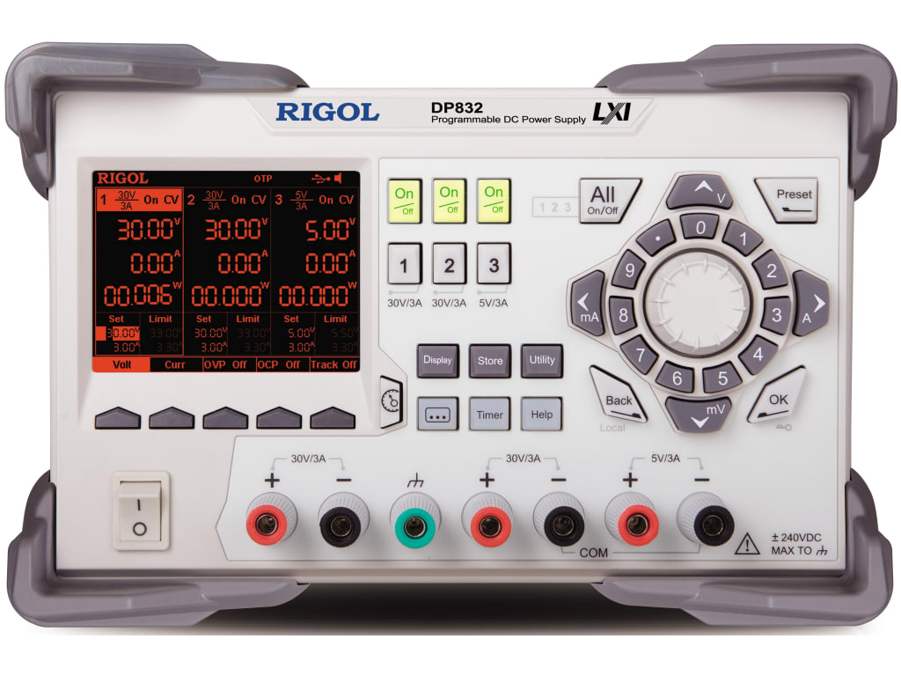 | $475 | [Tequipment.net](https://www.tequipment.net/RigolDP832.html) | Can be hacked to DP832A (fancy screen colors, higher measurement resolution) via [riglol](https://gotroot.ca/rigol/riglol/).
| Elenco TL-12 Banana to Mini-Grabber Cables | 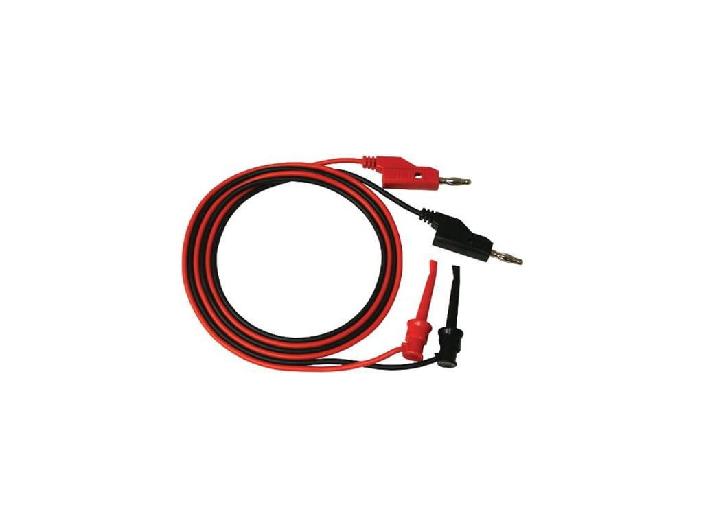 | $10 | [Tequipment.net](https://www.tequipment.net/ElencoTL-12.html) |

# Oscilloscope
| Item |Image|Unit Cost|Link|Note|
|------|-----|---------|----|----|
| 100MHz Entry Level Oscilloscope   Rigol DS1054Z | 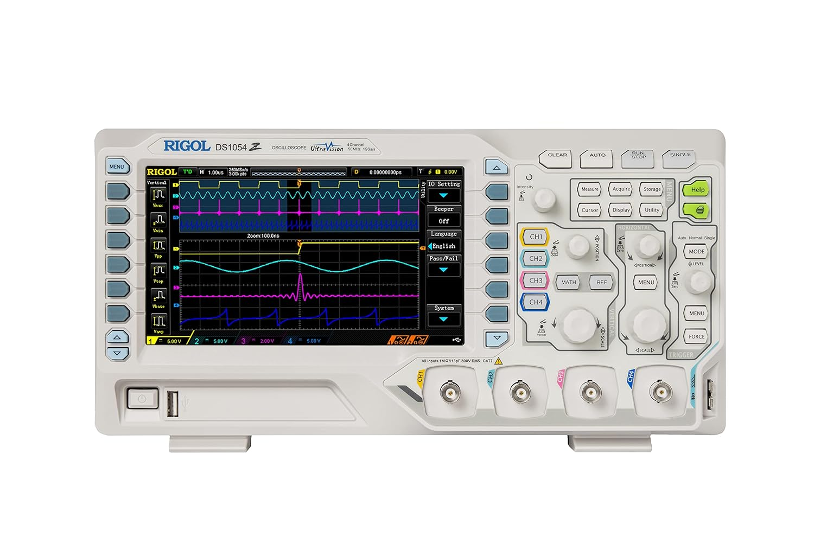 | $350 | [Amazon](https://amzn.to/3vLgqVU) | Can be hacked to 100MHz bandwidth plus additional decode options via [riglol](https://gotroot.ca/rigol/riglol/). |
| 300MHz Advanced Oscilloscope   R&S RTB2004 (RTB2K-COM4 / 1333.1005P99) | 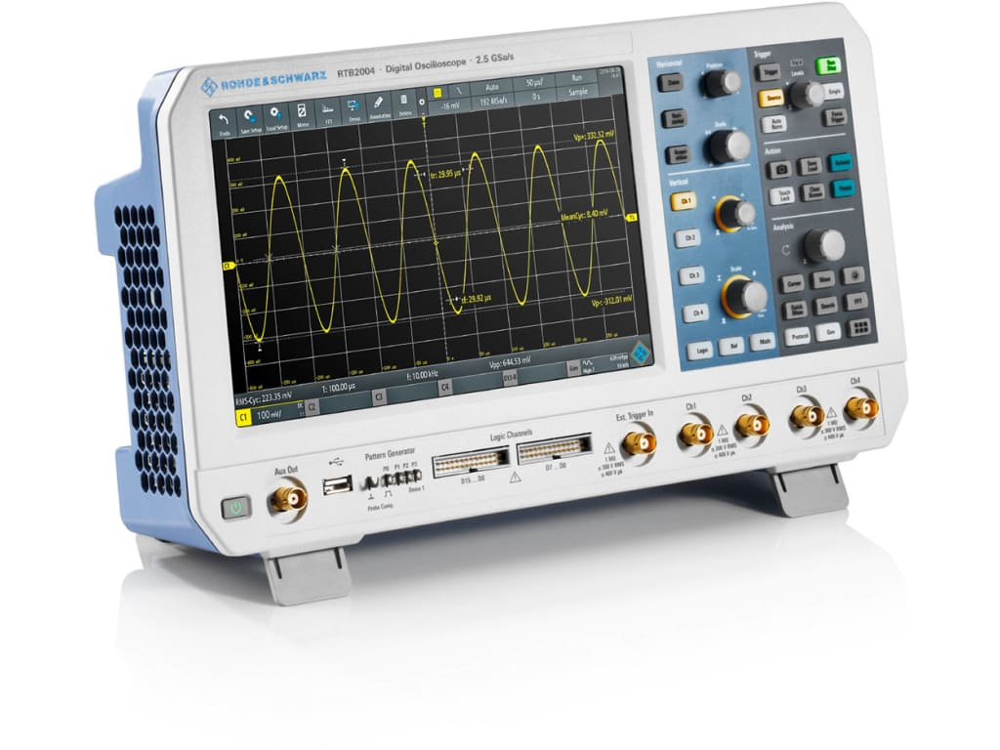 | $3k (educational discount in 2021)   $7.8k (current list price) | [Tequipment.net](https://www.tequipment.net/Rohde-&-Schwarz/RTB2K-COM4/Mixed-Signal-Oscilloscopes-(MSO)/) | Touch screen, excellent web UI.

# Multimeter
## Multimeters
| Item |Image|Unit Cost|Link|Note|
|------|-----|---------|----|----|
| Fluke 115 Field Service Technicians Multimeter | 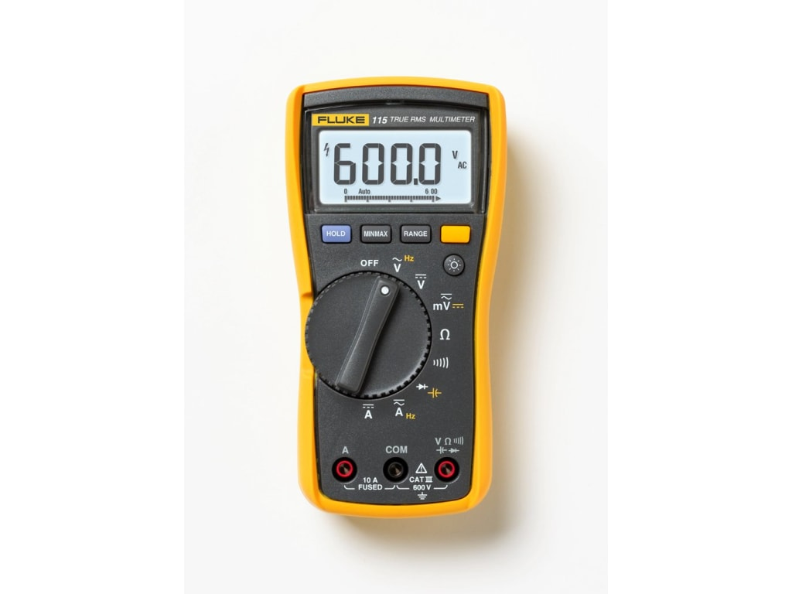 | $270 | [Tequipment.net](https://www.tequipment.net/Fluke115.html) | Good portable multimeter for continuity testing, DC / AC measurements, diode testing, etc. |

## Multimeter Cables
| Item |Image|Unit Cost|Link|Note|
|------|-----|---------|----|----|
| Fluke TP-88 Fine Tip Probe Covers | 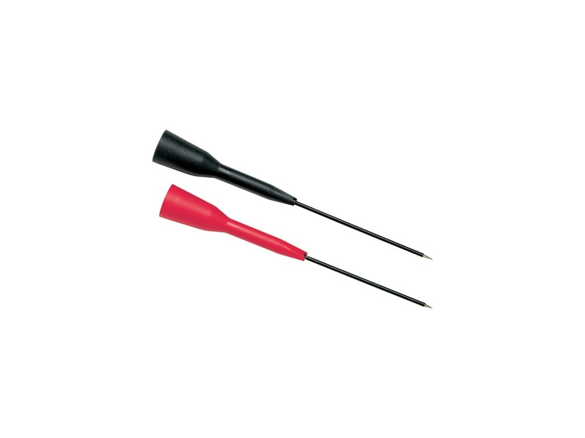 | $42 | [Tequipment.net](https://www.tequipment.net/fluketp88.html) | These snap on over the top of a regular diameter multimeter probe lead to convert them to a fine-tip probe. Great for probing small SMD components. Sharp tip easily pierces soldermask, conformal coat, or fingers (careful)! |
| ANCIRS 2mm Needle Test Probes (3 pairs) | 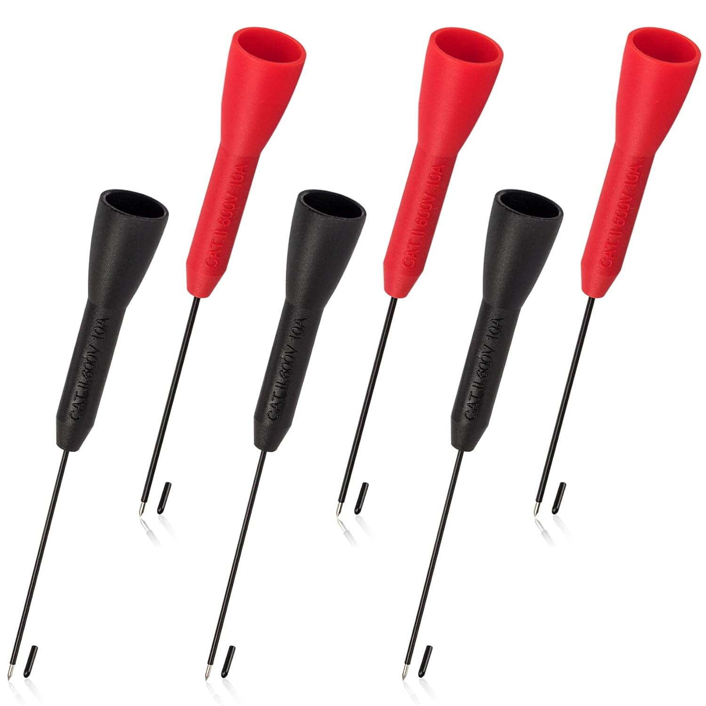 | $12 | [Amazon.com](https://amzn.to/43RYPbq) | Generic Amazon ripoff of the Fluke TP-88 fine tip test probes. Does the job just as well. |
| Fluke TL40 Retractable Fine-Tip Probe Leads | 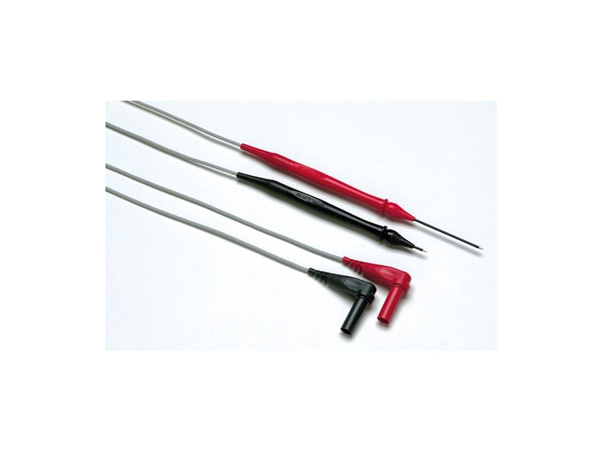 | $70 | [Tequipment.net](https://www.tequipment.net/FlukeTL40.html) | Fine tip test leads great for probing small SMD components. Sharp tip easily pierces soldermask, conformal coat, or fingers (careful)! |

# Thermal Camera
| Item |Image|Unit Cost|Link|Note|
|------|-----|---------|----|----|
| InfiRay P2 Pro Thermal Camera | 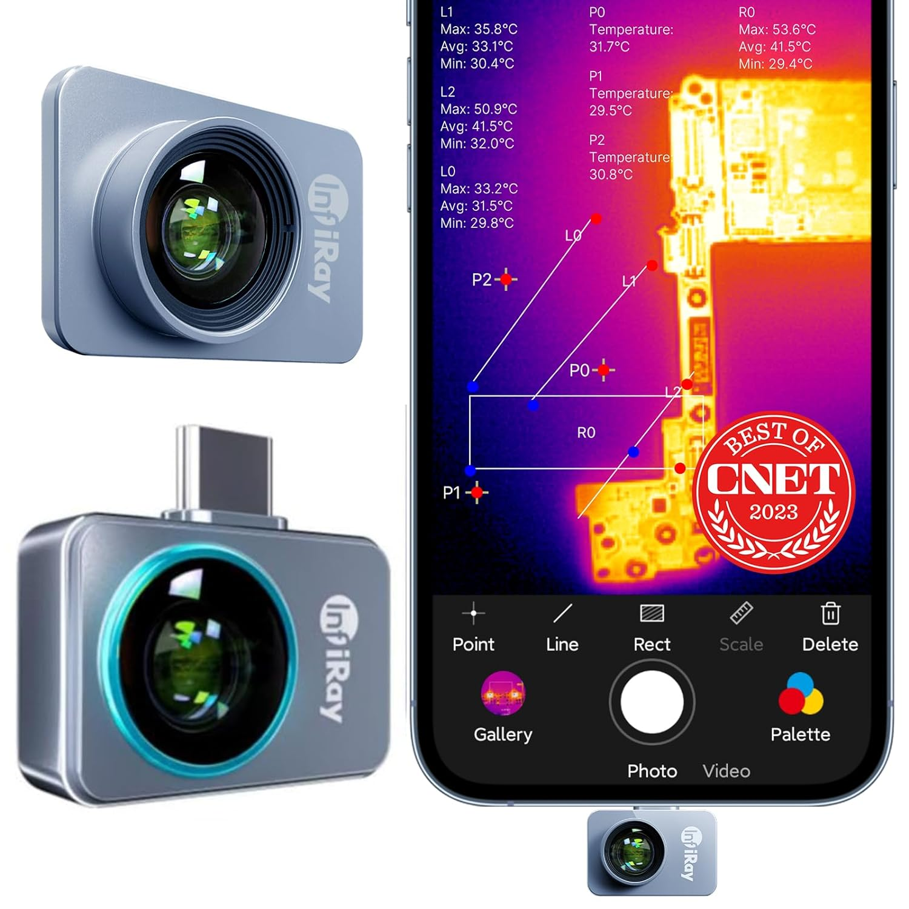 | $300 | [Amazon.com Android](https://amzn.to/4azAf1O)   [Amazon.com iPhone](https://amzn.to/3Jeni1c) | Attaches to a smartphone and allows live viewing of temperature in the field of view. Really convenient for debugging circuit boards (broken stuff is often hot). Previously used a FLIR ONE, but the InfiRay P2 Pro has much higher resolution and doesn't have an internal battery that needs to be recharged. |