# Equipment List

Here's a list of test equipment that I've used and can personally recommend!

# Soldering

| Item |Image|Unit Cost|Link|Note|
|------|-----|---------|----|----|
| JBC CD-1BQF Soldering Station    | 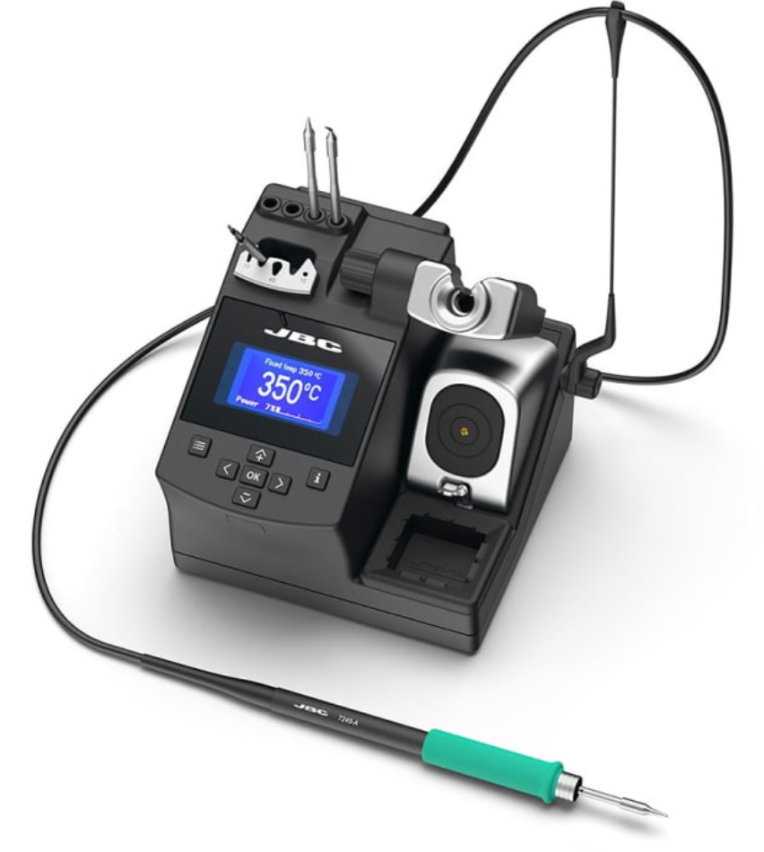 | $620.00 | [Tequipment.net](https://www.tequipment.net/JBC/CD-1BQF/Soldering-Stations/?v=0) | IMO: Much nicer UI than Hakko stations, more temperature flexibility than Metcal stations. One-handed tip changing is super convenient. |
| JBC C245768 General Purpose Chisel Tip | 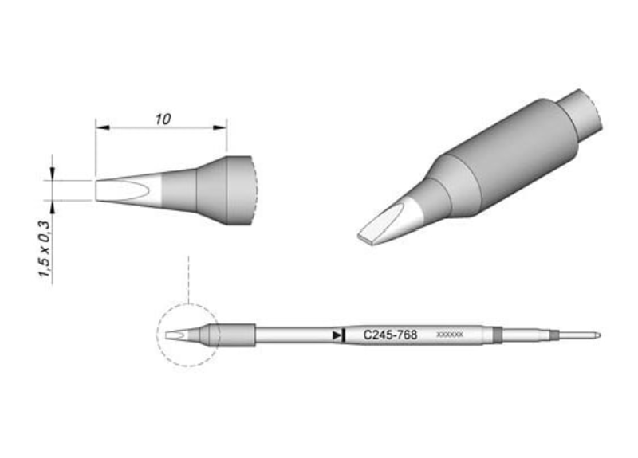 | $37.00 | [Tequipment.net](https://www.tequipment.net/JBC/C245768/Tips/) | Good for most solder joints and SMD / THT work. |
| JBC C245741 Large Chisel Tip | 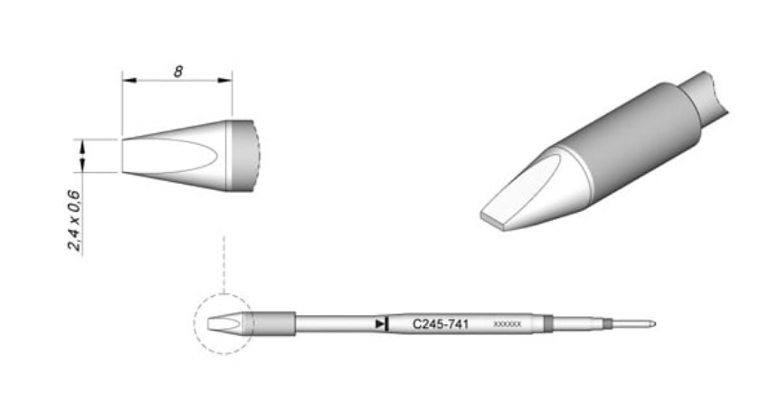 | $37.00 | [Tequipment.net](https://www.tequipment.net/JBC/C245741/Tips/) | Good for large gauge wires, big copper planes. |
| JBC C245126 Fine Bent Tip | 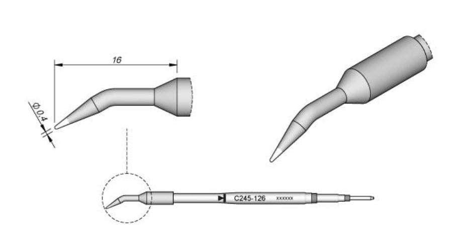 | $37.00 | [Tequipment.net](https://www.tequipment.net/JBC/C245126/Tips/) | Good for fine pitch rework. |
| Hakko 611-2 Dual Solder Reel Stand | 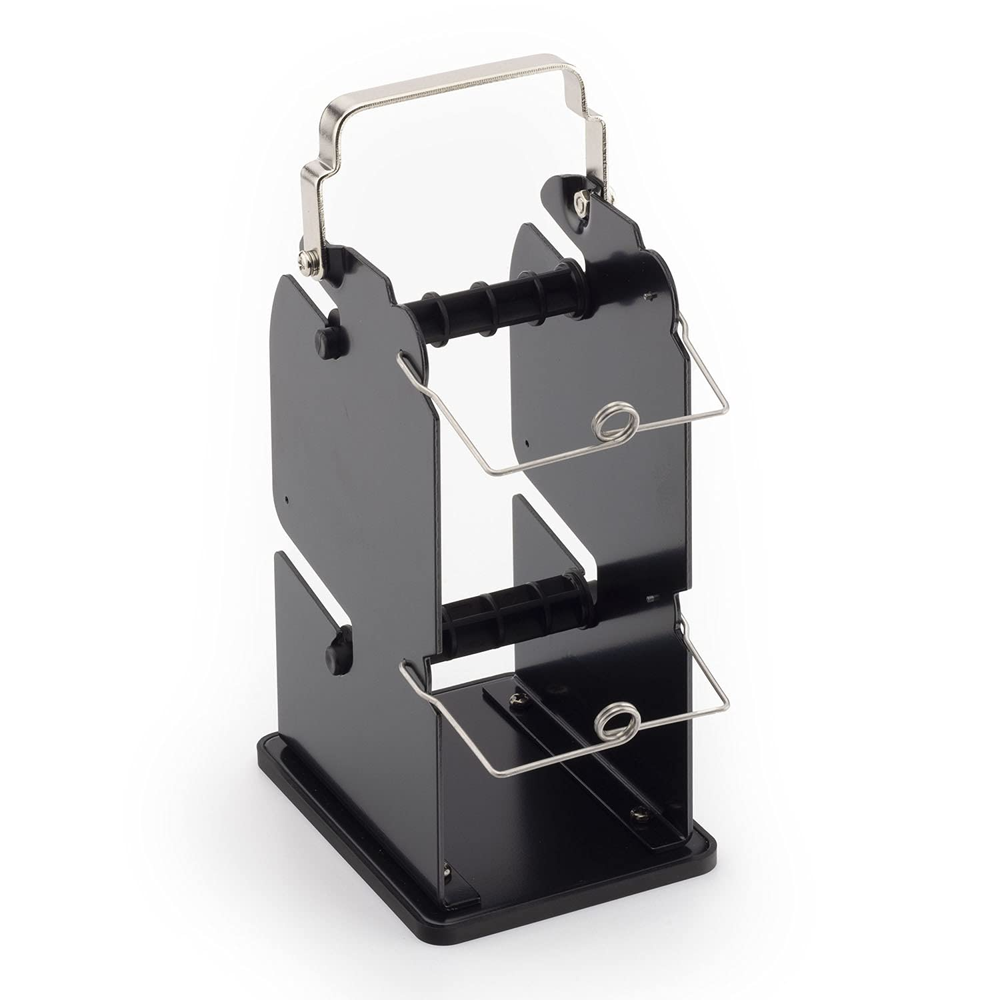 | $19 | [Amazon](https://amzn.to/4aPKSgm) | I use one reel for water wash solder, one reel for no clean solder (make sure to label which is which!). Can be grounded to your workbench's grounding system with the screw in the back. Little solder wire holders ensure that the solder itself stays in a convenient position and is also grounded (not really necessary but what the heck, we're allowed to have nice things). |
| Hakko FA-400-04 Benchtop Smoke Absorber | 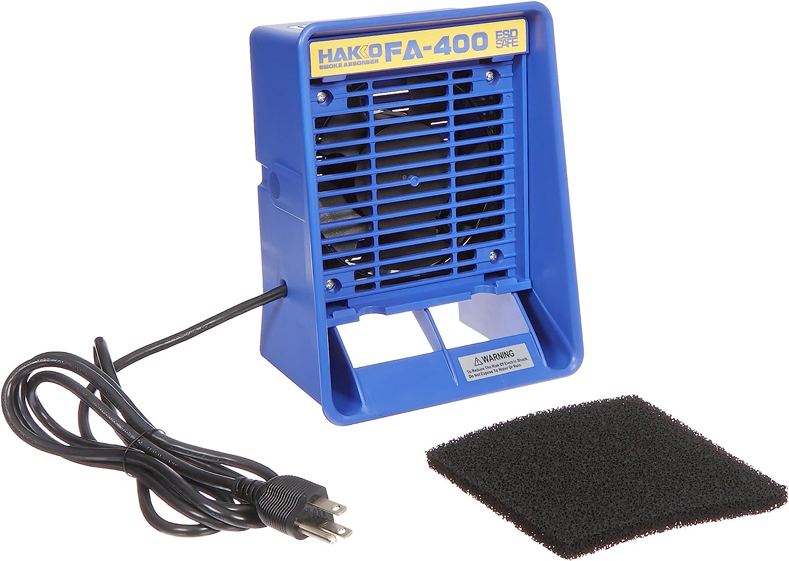 | $82 | [Amazon](https://amzn.to/3JaUsyT) | Can be laid on the bench face-down for higher velocity airflow close to the bench.    [Replacement Filters](https://amzn.to/4aQOv5Z) |

# Hand Tools
| Item |Image|Unit Cost|Link|Note|
|------|-----|---------|----|----|
| Hakko CHP CSP-30-1 Wire Strippers (20-30AWG) | 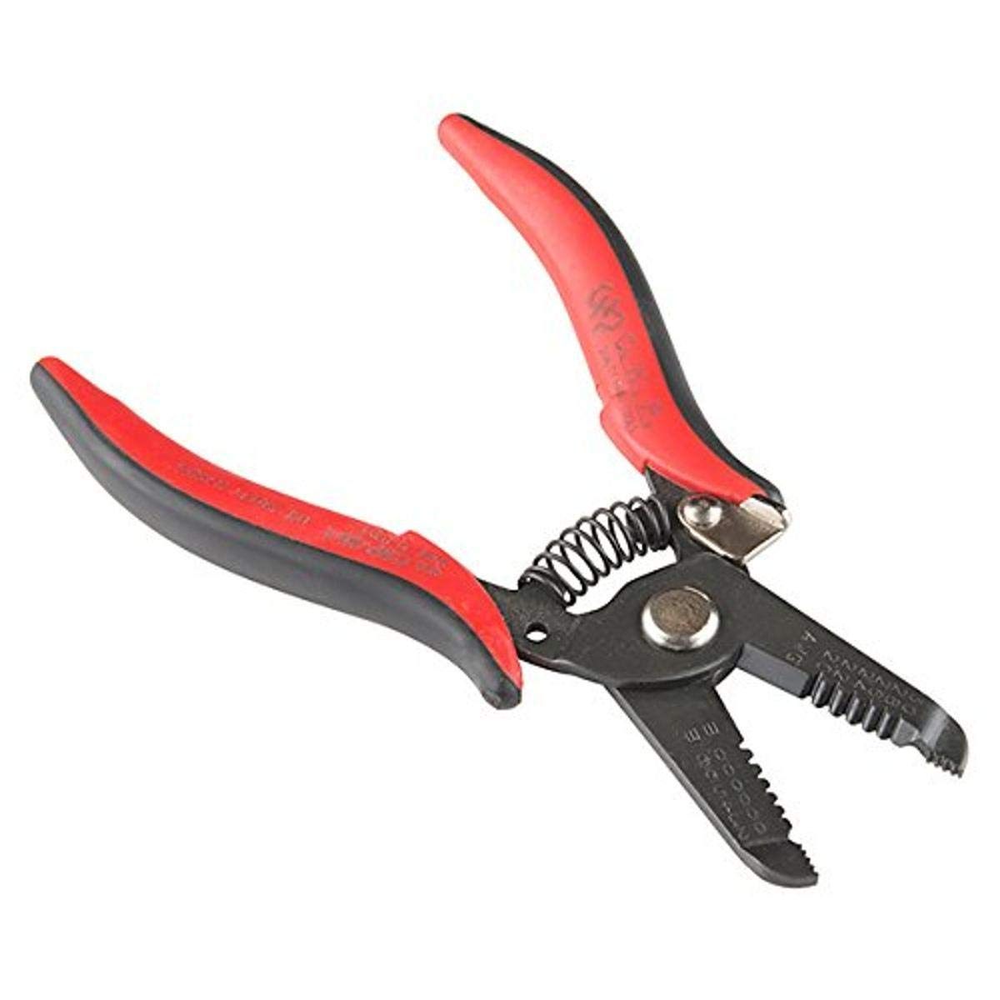 | $20 | [Amazon](https://amzn.to/3vIvMdV) |
| Hakko CHP CSP-30-2 Wire Strippers (10-20AWG) | 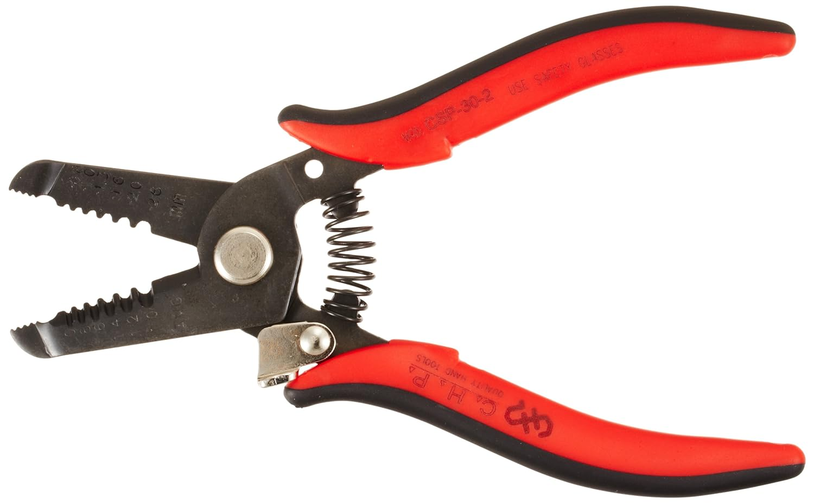 | $20 | [Amazon](https://amzn.to/4aFGNM0) |
| Hakko CHP-170 Micro Flush Cutters | 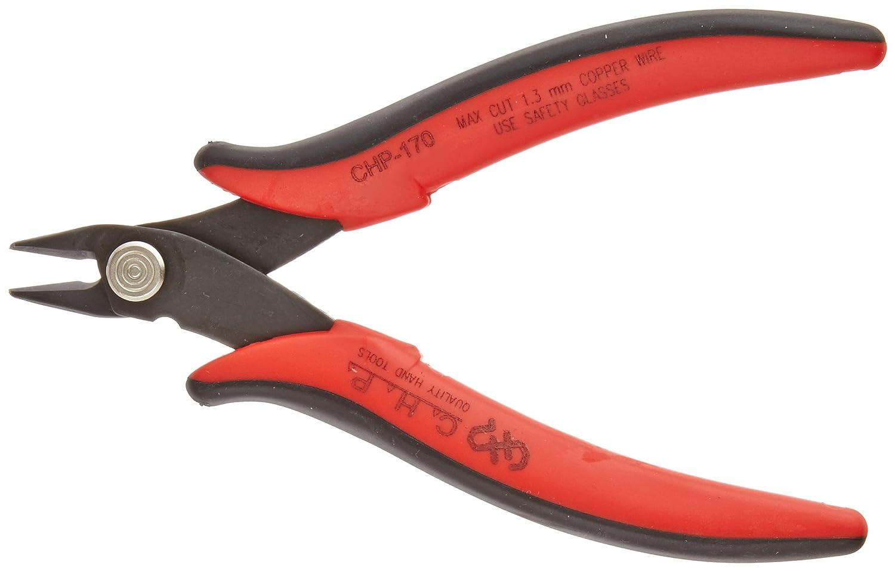 | $6 | [Amazon](https://amzn.to/3xxnNks) | For soft wire (copper) only! |
| Hakko TRR-58-G Macro Cutters | 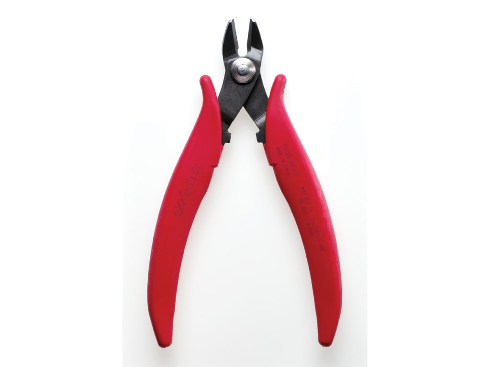 | $12 | [Tequipment.net](https://www.tequipment.net/HakkoTRR58G.html) | Useful for stuff the CHP-170's can't handle, like thicker wire or brass pieces on SMA connectors etc. |
| Hakko CHP-PN-2007 Needle Nose Pliers | 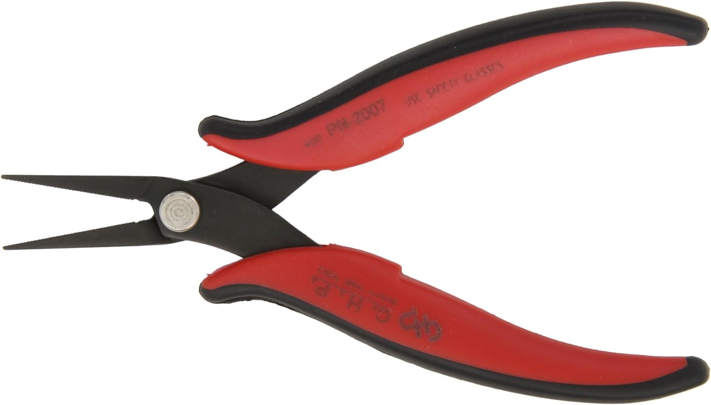 | $18 | [Amazon](https://amzn.to/3UaS7di) | Useful for bending component leads and hookup wire. |
| Hakko CHP-7-SA Stainless Steel Precision Tweezers | 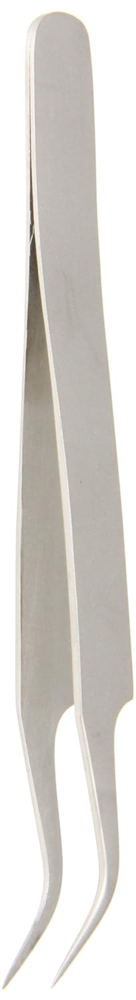 | $7 | [Amazon](https://amzn.to/4407bxN) | A nice soft closing feel with the right amount of spring force, (lower spring force reduces hand shake when placing really small parts). |

# Power Supplies / DC Loads
| Item |Image|Unit Cost|Link|Note|
|------|-----|---------|----|----|